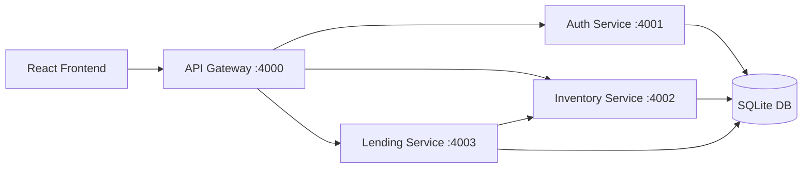

# Architecture and Database Design

## High-Level Architecture



## Microservice Responsibilities

1. Auth Service
   - User registration/login
   - JWT generation and verification
   - Role identity (`student`, `staff`, `admin`)

2. Inventory Service
   - Equipment CRUD
   - Availability management
   - Internal endpoints to increment/decrement stock

3. Lending Service
   - Borrow request lifecycle
   - Approve/reject/return actions
   - Overlap conflict checks for date ranges
   - Calls inventory internal endpoints during issue/return

4. API Gateway
   - Single entry point for frontend
   - Request routing and proxying to backend services

## Database Schema

```mermaid
erDiagram
    USERS ||--o{ BORROW_REQUESTS : "creates"
    EQUIPMENT ||--o{ BORROW_REQUESTS : "requested_for"

    USERS {
        int id PK
        string name
        string email UNIQUE
        string password_hash
        string role
        datetime created_at
    }

    EQUIPMENT {
        int id PK
        string name
        string category
        string equipment_condition
        string description
        int total_quantity
        int available_quantity
        datetime created_at
        datetime updated_at
    }

    BORROW_REQUESTS {
        int id PK
        int equipment_id FK
        int requester_id FK
        string requester_name
        string requester_role
        int quantity
        string start_date
        string end_date
        string status
        int approved_by
        string approver_name
        string remarks
        datetime issued_at
        datetime returned_at
        datetime created_at
    }
```

## Booking Conflict Rule

For each new request:

- find all requests for the same equipment with status in `PENDING` or `APPROVED`
- include only overlapping date ranges
- if `sum(overlapping quantities) + new quantity > total quantity`, reject request

This prevents overlapping overbooking.
